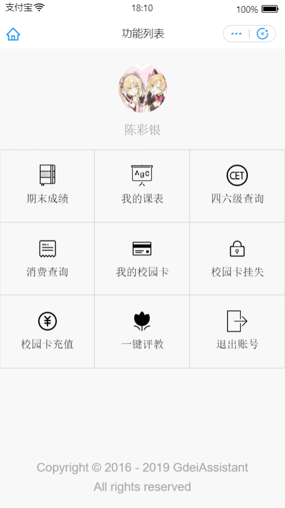
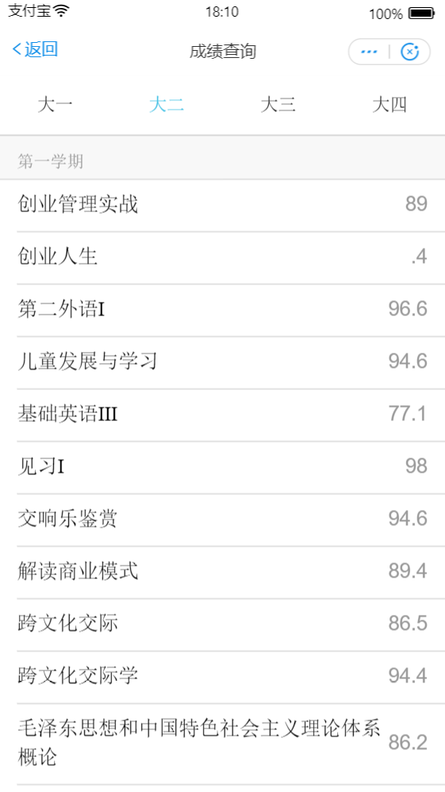

<p align="center">
  
</p>

# 广东二师助手微信小程序

**广东第二师范学院校园助手系统支付宝小程序客户端**，由多端统一开发框架Taro和支付宝小程序开发者工具经转编译和少量修改实现。小程序利用蚂蚁金服开放平台提供的API接口和框架组件，简单实现了校园查询基础服务。UI页面设计遵循支付宝小程序的设计规范，且引入了基于小程序自定义组件规范开发的开源UI组件库——小程序拓展组件，提供了更为丰富的用户交互效果和更为优秀的用户体验。应用的后端API数据接口由广东第二师范学院校园助手系统提供。

## 功能

- 成绩查询
- 课表查询
- 四六级查询
- 一键评教
- 消费查询
- 馆藏查询
- 校园卡查询
- 校园卡挂失

## 预览

<p>
  
  
  
</p>

## 体验

因支付宝小程序暂未开放个人注册，请下载项目到本地进行预览。

## 初始化

### 克隆仓库

```bash
$ git clone https://github.com/SweetRadish/GdeiAssistant-AlipayApp.git
```

### 配置参数

项目的配置参数被保存在项目目录下的data/data.js中

1. **防重放攻击**：requestValidateToken是移动端请求服务端的拥有防重放攻击保护的数据接口时，需要携带的令牌信息。该令牌信息应该与服务端中配置的防重放攻击令牌值相同，否则校验无法通过。详情请参考 [广东第二师范学院校园助手系统初始化说明](https://github.com/SweetRadish/GdeiAssistant/blob/master/README.md#%E5%88%9D%E5%A7%8B%E5%8C%96)

## 相关

广东二师助手微信小程序的后端API数据接口由[广东第二师范学院校园助手系统](https://github.com/SweetRadish/GdeiAssistant)提供

## 协议

[MIT License](http://opensource.org/licenses/MIT)

[Anti 996 License](https://github.com/996icu/996.ICU/blob/master/LICENSE)

Copyright (c) 2016 - 2019 GdeiAssistant

## 贡献

- 若你喜欢本项目，欢迎Star本项目

- 要贡献代码，欢迎Fork之后再提交[Pull Request](https://github.com/SweetRadish/GdeiAssistant-AlipayApp/pulls)

- 如果你有好的意见或建议，欢迎给我们提交[Issue](https://github.com/SweetRadish/GdeiAssistant-AlipayApp/issues)

## 联系

- 邮箱：[gdeiassistant@gmail.com](mailto:gdeiassistant@gmail.com)

## 声明

本项目只用作个人学习研究，如因使用本项目导致任何损失，本人概不负责。
